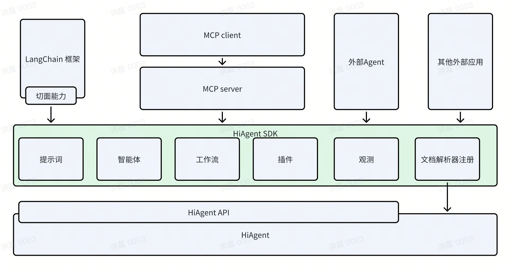

# Overview

English | [中文README](README.zh_CN.md)

HiAgent-SDK is the SDK of the HiAgent product from Volcano Engine. Developers can use this SDK to quickly develop functions and improve development efficiency. HiAgent-SDK provides a complete AI native application development suite, including a rich set of development components and application example code.

## Architecture



## Quick Start

``` python
from hiagent_core.langchain_integrations import LangChainTool
ocr_tool = LangChainTool.from_tool(OCRTool(...))
agent_tool = LangChainTool.from_tool(Agent(...).as_tool())
retriever_tool = LangChainTool.from_tool(KnowledgeRetriever(...).as_tool())
tools = [ocr_tool, agent_tool, retriever_tool]

# Pull the prompt template from the hub
# ReAct = Reason and Action
# https://smith.langchain.com/hub/hwchase17/react
prompt = hub.pull("hwchase17/structured-chat-agent")

callbacks = [CustomCallback()]

# export OPENAI_API_KEY=xxxx
# Initialize a ChatOpenAI model
llm = ChatOpenAI(
    model="ep-20241123112603-h4h97",  # pro
    base_url="https://ark.cn-beijing.volces.com/api/v3",
    callbacks=callbacks,
)
agent = create_structured_chat_agent(
    llm=llm,
    tools=tools,
    prompt=prompt,
)
# Create an agent executor from the agent and tools
agent_executor = AgentExecutor.from_agent_and_tools(
    agent=agent,
    tools=tools,
    verbose=False,
    callbacks=callbacks,
)
# Run the agent with a test query
response = agent_executor.invoke(
    {"input": "Recognize the text in the picture. The picture url is http://example.com/example.png"}
)

# Print the response from the agent
print("response:", response)

```

## Code of Conduct

Please check [Code of Conduct](CODE_OF_CONDUCT.md) for more details.

## Security

If you discover a potential security issue in this project, or think you may
have discovered a security issue, we ask that you notify Bytedance Security via our [security center](https://security.bytedance.com/src) or [vulnerability reporting email](sec@bytedance.com).

Please do **not** create a public GitHub issue.

## License

This project is licensed under the [Apache-2.0 License](LICENSE).
