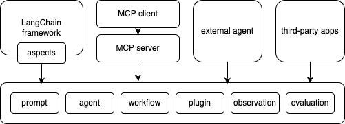

# 关于 HiAgent-SDK

[English](README.md) | 中文README

HiAgent-SDK是火山引擎的HiAgent产品的SDK，开发者可使用该SDK，快捷的开发功能，提升开发效率。HiAgent-SDK提供了完整的AI原生应用开发套件，包括丰富的开发组件和应用示例代码。

## 架构



## 快速开始

```python
from hiagent_core.langchain_integrations import LangChainTool
ocr_tool = LangChainTool.from_tool(OCRTool(...))
agent_tool = LangChainTool.from_tool(Agent(...).as_tool())
retriever_tool = LangChainTool.from_tool(KnowledgeRetriever(...).as_tool())
tools = [ocr_tool, agent_tool, retriever_tool]

# Pull the prompt template from the hub
# ReAct = Reason and Action
# https://smith.langchain.com/hub/hwchase17/react
prompt = hub.pull("hwchase17/structured-chat-agent")

callbacks = [CustomCallback()]

# export OPENAI_API_KEY=xxxx
# Initialize a ChatOpenAI model
llm = ChatOpenAI(
    model="ep-20241123112603-h4h97",  # pro
    base_url="https://ark.cn-beijing.volces.com/api/v3",
    callbacks=callbacks,
)
agent = create_structured_chat_agent(
    llm=llm,
    tools=tools,
    prompt=prompt,
)
# Create an agent executor from the agent and tools
agent_executor = AgentExecutor.from_agent_and_tools(
    agent=agent,
    tools=tools,
    verbose=False,
    callbacks=callbacks,
)
# Run the agent with a test query
response = agent_executor.invoke(
    {"input": "识别图片中的文字，图片地址是 http://example.com/example.png"}
)

# Print the response from the agent
print("response:", response)
```

## License

该项目采用 [Apache-2.0 License](LICENSE) 许可。
