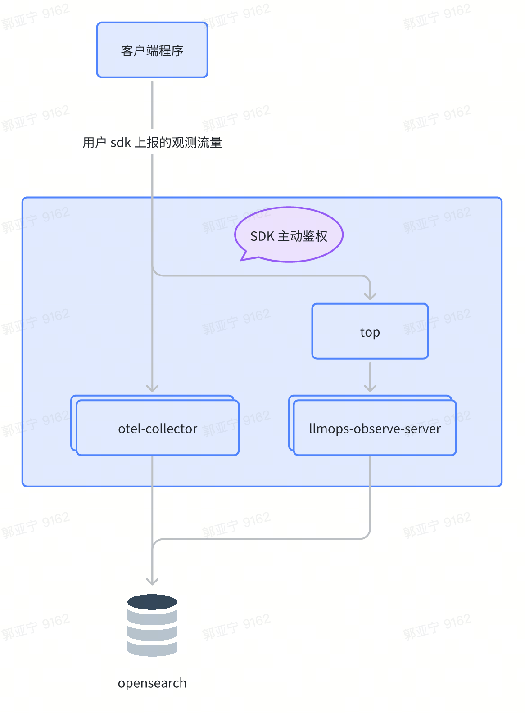

# HiAgent Observe SDK

## OpenTelemetry Trace

OpenTelemetry（OTel）是一个开源的、具备厂商中立性的可观测性框架。它提供了一组规范、API 和库，基于特定结构化数据建模，以输出应用程序的分布式追踪（Trace）、指标（Metrics）和日志（Log）数据。​
HiAgent 支持接收来自 OpenTelemetry 客户端上报的 Trace 数据并可视化展示，从而实现对应用程序的深度监控和分析。​
基于 OpenTelemetry 客户端上报的流程图如下所示：​
​

​

## OpenTelemetry Trace 集成方式​

通过 OpenTelemetry SDK 上报 Trace​，你可以使用各种语言的 OpenTelemetry SDK 将 Trace 数据上报到 HiAgent。通过 OpenTelemetry SDK 上报时，开发者需要直接在代码中引入 OpenTelemetry SDK 来创建和管理 Trace 数据（例如创建 Span、设置 Attribute、记录 Event 等）。这种方式需要开发者对 OpenTelemetry 的 SDK 有一定的了解，并在代码中明确实现埋点逻辑。

### 常见问题​

#### HiAgent 支持什么协议？​

HiAgent 不支持 GRPC 协议的 OpenTelemetry Endpoint，需使用 http/protobuf 协议。​以 Python 为例，配置示例如下：​
​

``` python
import os
import time

from dotenv import load_dotenv
from hiagent_observe import client
from opentelemetry import trace

load_dotenv()


if __name__ == "__main__":
  try:
    # 初始化 OpenTelemetry Client，并且注入鉴权的 header
    # 鉴权的 header 每个小时会自动刷新
    client.init(
      # 配置为 HiAgent 的 OpenTelemetry Endpoint
      trace_endpoint=os.getenv("HIAGENT_TRACE_ENDPOINT"),
      # 配置为 HiAgent 的 Top Endpoint
      top_endpoint=os.getenv("HIAGENT_TOP_ENDPOINT"),
      # 配置为 HiAgent 的个人中心申请的 access key
      ak=os.getenv("VOLC_ACCESSKEY"),
      # 配置为 HiAgent 的个人中心申请的 secret key
      sk=os.getenv("VOLC_SECRETKEY"),
      # 配置为 HiAgent 的自定义应用的 workspace id
      workspace_id=os.getenv("WORKSPACE_ID"),
      # 配置为 HiAgent 的自定义应用的 app id
      app_id=os.getenv("CUSTOM_APP_ID"),
    )
  except Exception as e:
    raise RuntimeError(e)

  tracer = trace.get_tracer("example-tracer") # 创建一个 Tracer

  for i in range(100000):
    with tracer.start_as_current_span("main-operation") as root_span:
      with tracer.start_as_current_span("do-work") as span:
        span.set_attributes(
          {
            "http.method": "GET",
            "http.route": "/api/work",
            "http.status_code": 200,
          }
        )
    print("push trace")
    time.sleep(2)
```

更完整的例子参考[这里](https://github.com/volcengine/hiagent-python-sdk/blob/feat/span_type/libs/observe/samples/sample_chainlit.py)。
